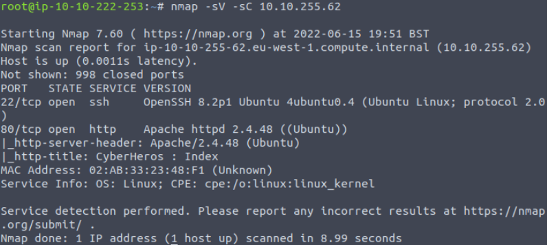
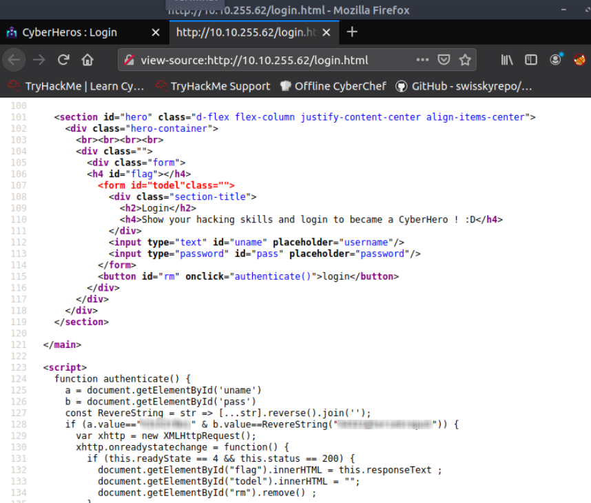
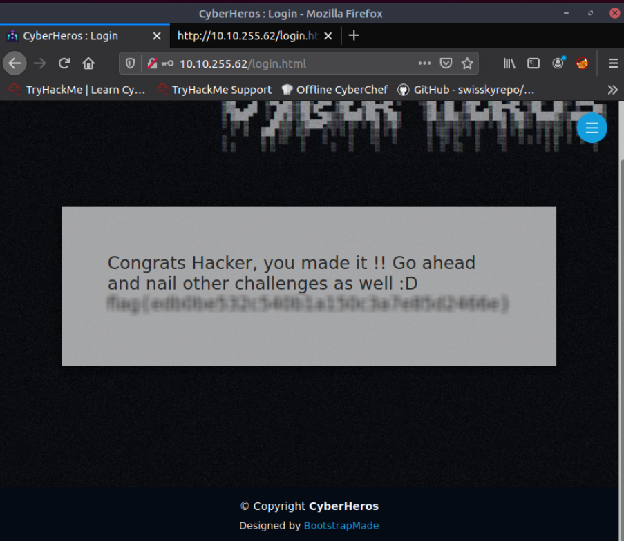

## TryHackMe | CyberHeroes

### Reconnaissance

Start with an nmap scan against the target machine: 

```
nmap -sV -sC [Target IP]
```
We use -sV for a more verbose response, and -sC for standard scripts. Additionally, if you'd like to put the output into a file, you can add -oN [filename].



Our scan shows us that ports 22 (ssh) and 80 (http) open. Lets go check and see what's available on the web server server.

On the main webpage it asks us to hack into their login system. So lets go to the login page.

First step is to inspect the source code. 

We can see where the input boxes are and that they're assigned to the IDs uname and pass. If we look just below that, there's a script!



In the script, you can see they're setting the variable "a" equivlant to "uname," which is our username, and "b" is equivalent to "pass," or our password. Upon further examination of the function, you can find an if statement that seems to be testing what we input, and seeing if it matches two certain strings.

Use those values and you're now able to log in!



## Congratulations on completing the CyberHeroes room!
